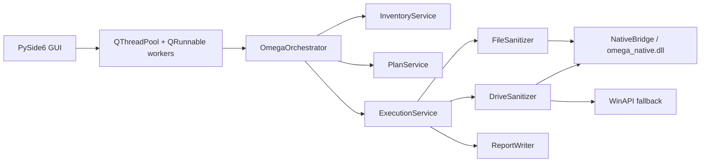

# Architecture

OMEGA Protocol is a Windows-only application structured as explicit layers:

## Architectural Rules

- The UI must not perform blocking I/O on the main thread.
- Inventory uses TTL-based caching and explicit error classes.
- Preflight is its own domain contract, not a side effect of execution.
- Execution engines must never overstate assurance.
- Report generation still happens when the session ends with partial failure.

## Public Contracts

- `InventorySnapshot`
- `PreflightResult`
- `ExecutionPlan`
- `ExecutionResult`
- `SessionBundle`
- `SessionEvent`
- `RetryPolicy`
- `AppState`

## Frontend

- [omega_protocol/ui/app.py](OMEGA/omega_protocol/ui/app.py) contains the `QMainWindow`.
- File and drive lists are backed by `QAbstractListModel`.
- Preflight and execution run on `QThreadPool`, and the UI receives typed events only.
- Log updates are buffered to avoid unnecessary redraw pressure.

## Backend

- `InventoryService` queries PowerShell, applies privilege-aware fallbacks, and classifies failures.
- `PlanService` combines inventory and policy rules into a typed preflight result.
- `ExecutionService` runs plans, converts exceptions into explicit failure results, and always builds the report bundle.
- `NativeBridge` is optional; the Python fallback remains available when the DLL is missing.
