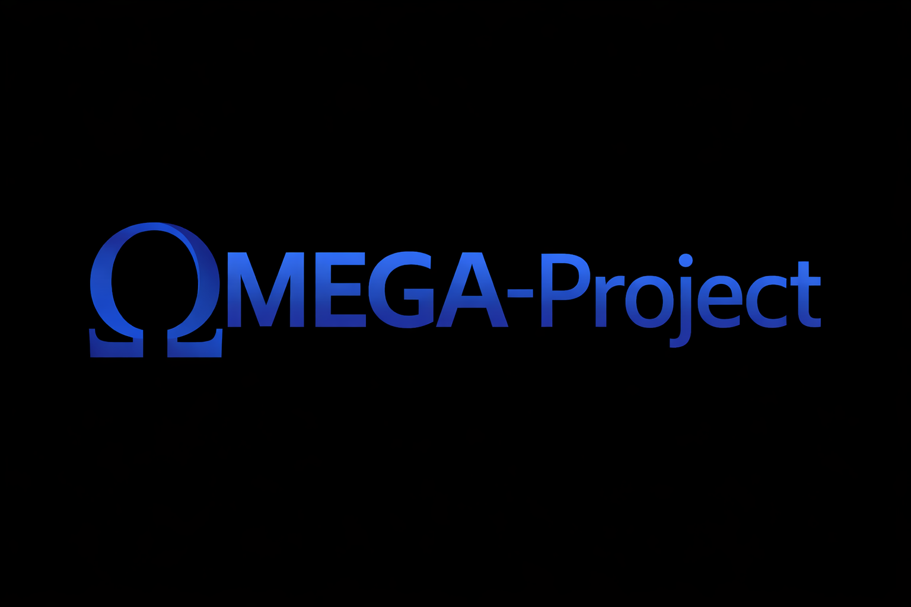

<p align="center">
  
</p>

**A transparent, honest Windows data sanitization tool that separates file-level and drive-level erasure workflows.**

OMEGA Protocol provides Windows administrators and security professionals with reliable data sanitization capabilities backed by actual technical constraints—not marketing promises. The application explicitly reports what it can and cannot guarantee, making it suitable for compliant data destruction workflows where audit trails matter.

---

## Table of Contents

- [What This Project Does](#what-this-project-does)
- [Why This Exists](#why-this-exists)
- [Technical Architecture](#technical-architecture)
- [Supported Methods](#supported-methods)
- [Assurance Levels & Guarantees](#assurance-levels--guarantees)
- [Installation](#installation)
- [Usage](#usage)
- [Development](#development)
- [Security & Threat Model](#security--threat-model)
- [Contributing](#contributing)
- [License](#license)

---

## What This Project Does

OMEGA Protocol is a Windows-only data sanitization framework that:

1. **File Sanitization** – Overwrites single files through multiple passes (zero + random) and verifies completion
2. **Drive Sanitization** – Erases entire volumes via device-level commands (`IOCTL_STORAGE_REINITIALIZE_MEDIA`) when the OS and hardware support it
3. **Offline Support** – Provides a CLI runner for WinPE environments where the live OS cannot guarantee safe access
4. **Compliance Reporting** – Generates audit trails in JSON, CSV, HTML, and PDF formats with explicit success/failure states

### CORE PHILOSOPHY

**The application does not overstate assurance levels.**

If it cannot prove a strong sanitization outcome using supported methods, it reports the limitation instead of marketing a false success. This approach is deliberately conservative and suitable for regulated data destruction workflows.

---

## Why This Exists

Most Windows sanitization tools treat all storage media and all deletion scenarios the same way. OMEGA Protocol separates two fundamentally different problems:

### The Problem: One-Size-Fits-All Approaches Fail

Different storage types have completely different sanitization characteristics:

- **HDD (hard disk drive)**: File overwrite + device commands = predictable
- **SSD/NVMe**: File overwrite ≠ Device Purge (wear-leveling, TRIM, garbage collection interfere)
- **SATA SSD**: Often requires offline/WinPE for any meaningful device purge
- **USB/removable media**: Firmware behavior is often unknown; overwrite offers no guarantee

Older tools pretend all these work the same. OMEGA Protocol doesn't.

### The Solution: Explicit Separation

```
File Sanitize  → Individual file overwrite (works as documented on HDD, limited on SSD)
Drive Sanitize → Device-level erasure (works when firmware supports it; blocked when it doesn't)
```

Each workflow reports its actual assurance target, not a generic "deleted permanently" message.

---

## Technical Architecture

### Layered Design

```
┌─────────────────────────────────────────────────────────────┐
│  PySide6 GUI (Non-blocking UI with QThreadPool workers)    │
└────────────────────┬────────────────────────────────────────┘
                     │
                ┌────▼─────────────────┐
                │  OmegaOrchestrator   │
                │  (Session Manager)   │
                └────┬────────┬────────┘
                     │        │
        ┌────────────┼────┐   │
        │            │    │   │
   ┌────▼──┐   ┌────▼────▼──┐   ┌──────────────┐
   │Inventory   │ Planning   │   │ Execution   │
   │Service     │Service     │   │ Service     │
   └───────────┘ └─────┬─────┘   └──────┬──────┘
                       │                 │
                       └────┬────────────┘
                            │
                 ┌──────────┴──────────┐
                 │                     │
           ┌────▼───────┐     ┌───────▼──────┐
           │File Engine │     │Drive Engine  │
           │(Overwrite) │     │(Device Cmds) │
           └────┬───────┘     └───────┬──────┘
                │                     │
                └──────────┬──────────┘
                           │
            ┌──────────────▼──────────────┐
            │     NativeBridge            │
            │  (omega_native.dll)         │
            │  Fallback: WinAPI           │
            └─────────────────────────────┘
```

### Key Architectural Principles

- **Non-blocking UI**: All I/O and computation run on `QThreadPool` workers; the UI receives typed events only
- **Explicit contracts**: Every public function returns typed objects, not error codes
- **Preflight-first**: Plans are validated before execution; inventory is cached with TTL-based expiry
- **Fail-with-data**: Even if execution fails, the report bundle is generated with explicit failure reasons
- **No silent success**: Every result includes an `assurance_achieved` field that reflects actual outcome, not intent

---

## Supported Methods

### File Sanitization

| Storage Type | Method | Assurance Level | Notes |
|---|---|---|---|
| **HDD** (single file) | Rename → 0x00 overwrite → verify → random → truncate → unlink | Best-Effort File Sanitize | Supported |
| **SSD/NVMe** (single file) | Same (Python fallback or C++ via `lower.cpp`) | Best-Effort File Sanitize | ⚠️ **Warning**: TRIM/GC may bypass overwrite; metadata may remain |
| — | — | — | — |

**Why Best-Effort on SSD?**
- SSDs use wear-leveling; file-level overwrite doesn't guarantee the NAND pages that held your data are overwritten
- Modern SSDs trim deallocated blocks before any tool sees them
- The OS may not know the physical location of your data

### Drive Sanitization

| Storage Type | Method | Assurance Level | Conditions |
|---|---|---|---|
| **NVMe data disk** | `IOCTL_STORAGE_REINITIALIZE_MEDIA` | Device Purge | Requires firmware support; WinAPI accepts the command and reports success |
| **HDD data disk** | Same IOCTL | Device Clear | Only if media type reports as HDD |
| **SATA SSD data disk** | Blocked online → offline runner required | Device Purge (offline) | ⚠️ May require WinPE; online attempt returns `Destroy Required` |
| **System disk** | Blocked entirely | — | Cannot guarantee safe partition table erasure while OS is running |
| **USB / removable** | Conservative downgrade | Destroy Required / Unsupported | Firmware behavior unknown; no purge promise |

### Implementation: C++ Native Backend (lower.cpp)

The `omega_native.dll` (compiled from `lower.cpp`) provides:

```cpp
// File sanitization via BCrypt + WinAPI
int omega_file_sanitize(
    const wchar_t* path,
    int passes,
    int dry_run,
    wchar_t* message_buffer,
    unsigned int message_capacity
);
```

**What it does:**
1. Opens file with `GENERIC_READ | GENERIC_WRITE` (exclusive access)
2. Gets file size via `GetFileSizeEx`
3. **Pass 1**: Zero overwrite (1MB chunks, flushed)
4. **Pass 2**: Random overwrite via `BCryptGenRandom` (1MB chunks, flushed)
5. Truncates file size to 0
6. Returns explicit error codes (not "success/failure" boolean)

**Why C++?**
- **Performance**: 1MB chunks at native speed (not Python I/O)
- **Explicit error handling**: Every WinAPI call is checked; errors include `DWORD` + formatted message
- **Verifiable**: Source code auditable; binary reproducible

**Python Fallback:**
If the DLL is missing, Python uses equivalent overwrite passes. Slower, but same logic.

---

## Assurance Levels & Guarantees

### What I Guarantee

✅ **Best-Effort File Sanitize**
- File content is overwritten twice (0x00, then random)
- Overwrite is verified via re-read
- File metadata is cleared and file is unlinked
- **Applies to**: Single files on HDD; single files on SSD with warning
- **Why not stronger?**: I cannot verify NAND cell state on SSD or garbage collection behavior on HDD

✅ **Device Clear** (HDD data disk)
- `IOCTL_STORAGE_REINITIALIZE_MEDIA` is accepted by firmware
- All logical blocks are marked as deallocated
- **Why not stronger?**: I cannot verify what the firmware actually does; we only know it accepted the command

✅ **Device Purge** (NVMe data disk or offline SATA SSD)
- Same as Device Clear, but reported for NVMe or after offline run
- **Why the distinction?** NVMe drivers more consistently implement the IOCTL correctly

### What I Don't Promise

❌ **Laboratory NAND cell recovery** – Out of scope. I cannot prevent microscopic analysis of discarded SSD cells.

❌ **Firmware defects** – If the hardware firmware is broken or malicious, no software sanitization is reliable.

❌ **Cloud/backup/shadow copies** – It only sanitize the local instance. Copies elsewhere are your responsibility.

❌ **System disk online** – it cannot safely erase the disk your OS runs on while it's running.

❌ **USB firmware behavior** – It cannot predict or verify what cheap USB controller firmware does with overwrite commands.

### Reporting Rule (Key Principle)

**If program cannot prove it, he report the limitation.**

If a drive reports as SSD but program don't have safe device-level commands, the report will show `Destroy Required` or `Unsupported` instead of claiming success.

---

## Installation

### Requirements

- **Windows 10/11** (x64)
- **Python 3.12+**
- **Visual Studio 2022** (if you want re-building native backend; requires MSVC and Windows SDK)
- **CMake 3.20+** (optional; for local DLL rebuild)

### Setup

```powershell
# Clone or extract the repository
git clone https://github.com/your-org/OMEGA-Protocol.git
cd OMEGA-Protocol

# Create virtual environment
python -m venv .venv
.\.venv\Scripts\python.exe -m pip install --upgrade pip
.\.venv\Scripts\python.exe -m pip install -e .[dev,build]
```

## EXAMPLE-USE (.exe version): [Youtube](https://youtu.be/Rak6qHz1oVs)

### Building the Native Backend (Optional)

The project ships with a pre-built `omega_native.dll`. To rebuild from source:

```powershell
# Using CMake
cmake -S . -B build -A x64 -DCMAKE_BUILD_TYPE=Release
cmake --build build --config Release --verbose

# Copy to omega_protocol directory
copy build\Release\omega_native.dll omega_protocol\omega_native.dll
```

---

## Usage

### GUI (PySide6)

```powershell
.\.venv\Scripts\python.exe OMEGA_BETA.py
```

The GUI allows you to:
1. Inventory attached drives and volumes
2. Select files or whole drives for sanitization
3. Choose `File Sanitize` or `Drive Sanitize` workflow
4. Review preflight report (assurance levels, risks)
5. Execute and monitor progress
6. Generate audit report (JSON, CSV, HTML, PDF)

### CLI (Offline Runner)

Suitable for WinPE or service-context execution:

```powershell
# Dry-run: show the plan without executing
.\.venv\Scripts\python.exe omega_offline.py --disk 1 --json

# Execute: sanitize disk 1 and output JSON results
.\.venv\Scripts\python.exe omega_offline.py --disk 1 --execute --json
```

### Windows Command Prompt Launcher

If PowerShell execution policy is restricted:

```cmd
.\Run-OMEGA-Source.cmd
```

---

## Development

### Project Structure

```
omega_protocol/          # Main package
├── ui/                  # PySide6 GUI
├── services/            # Orchestration, inventory, planning, execution
├── engines/             # File and drive sanitization implementations
├── report_templates/    # Jinja2 report templates
└── omega_native.dll     # Pre-built C++ backend (gitignored at runtime)

lower.cpp               # C++ source for omega_native.dll
CMakeLists.txt          # CMake build configuration
tests/                  # Unit and integration tests
pyproject.toml          # Python package metadata and dependencies
```

### Running Tests

```powershell
.\.venv\Scripts\python.exe -m pytest tests/
```

### Code Quality

```powershell
# Linting
.\.venv\Scripts\python.exe -m ruff check .

# Type checking
.\.venv\Scripts\python.exe -m mypy omega_protocol tests OMEGA_BETA.py omega_offline.py

# Coverage (runs with pytest.ini defaults)
.\.venv\Scripts\python.exe -m pytest --cov=omega_protocol tests/
```

### Change Rules

- Do not add blocking I/O back to the UI thread
- Do not use `Clear`, `Purge`, or `Destroy` labels for individual file workflows
- If an action cannot be justified technically and honestly, the plan must block it
- New warnings and errors must remain understandable for the operator

---

## Security & Threat Model

### Intended Use

OMEGA Protocol is designed to **reduce recoverability** of data after **intentional sanitization workflows**, not to guarantee absolute information-theoretic security.

### What Omega Protect Against

✅ Ordinary recovery after `delete` or `unlink`  
✅ Logical recovery attempts against HDD file remnants  
✅ Supported NVMe device-level erasure  
✅ Operator mistakes from unclear preflight information  

### What Omega Don't Protect Against

❌ NAND-level cell recovery (laboratory forensics)  
❌ Malicious or defective firmware  
❌ Cloud backups, shadow copies, pagefile, hibernation data  
❌ Cheap USB controller firmware lying about TRIM/DISCARD behavior  

### BitLocker Note

BitLocker improves the risk profile (whole-volume encryption + purge key) but does not replace media sanitization. If you have BitLocker enabled and purge the drive, the encrypted data plus encryption key are both destroyed.

### Audit & Logging

Every session generates:
- **Session bundle** with detailed success/failure states per operation
- **Report formats**: JSON (machine-readable), CSV (spreadsheet-ready), HTML, PDF (human-readable)
- **Error codes**: All WinAPI failures are captured with Windows error descriptions
- **Timestamped events**: Start/stop, preflight, execution, report generation

---

### Key Areas
- Additional report templates
- Offline runner improvements for niche storage devices
- Better error messaging for specific WinAPI failures
- Test coverage for device enumeration edge cases

---

## License

[LICENSE](https://github.com/X-3306/OMEGA-Project/blob/main/LICENSE) 

[COMMERSIAL](https://github.com/X-3306/OMEGA-Project/blob/main/COMMERCIAL.md)

---

## Frequently Asked Questions

**Q: Why not use DBAN or Eraser?**  
A: OMEGA Protocol separates file and drive workflows explicitly and reports actual assurance levels. It's designed for audit-trail-required environments, not consumer-grade deletion.

**Q: Can I sanitize my C: drive?**  
A: No. Blocking system disk sanitization online protects against accidental OS destruction. Use the offline runner from WinPE if you need to.

**Q: What if the native DLL is missing?**  
A: Python fallback handles file sanitization (slower but same logic). Device commands fall back to WinAPI.

**Q: Why does it say "Best-Effort" on my SSD?**  
A: SSDs use wear-leveling and TRIM. The OS doesn't always know where your data physically lives. I'm honest about it instead of pretending otherwise.

**Q: Can I run this against network shares?**  
A: No. Network behavior is unreliable and outside our threat model. Sanitize local drives only.

---

**For detailed architecture, API contracts, and threat model analysis, see the [docs/](https://github.com/X-3306/OMEGA-Project/tree/main/docs) directory.**
